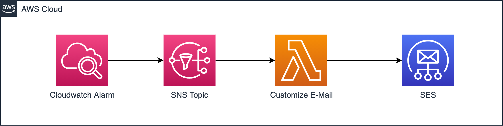
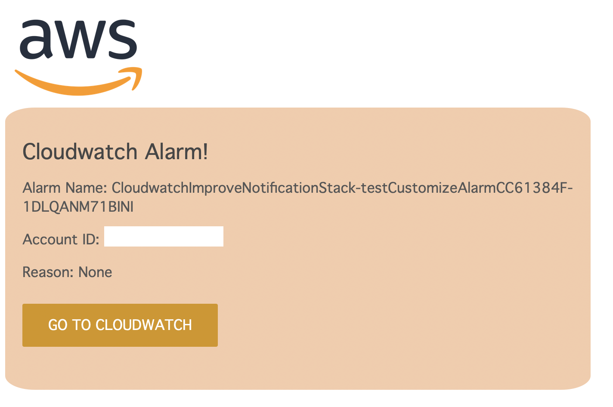

# Cloudwatch customise alarm

This CDK template shows you how to customise a cloudwatch alarm.
A standard approach for monitoring with cloudwatch is to receive email notifications in case an alarm starts. The default cloudwatch alarm notifications don't look really nice and are not very adaptable.

To be able to add a logo and more information like links to cloudwatch, ITSM tools it is a good approach to use HTML templates via SES. In SES you have to verify your destionation and source email first. SNS takes normally care of that for you. But SNS cannot send HTML emails.

If you just want to cusotmize your text it is also possible via SNS only, but it still dosn't look nice ;-)
 

## Architecture



1. Cloudwatch Alarm: Some cloudwatch alarm
2. SNS Topic which will be triggered by the cloudwatch alarm
3. Lambda which will be called by the SNS topic
4. SES will be used by the lambda to send out HTML emails

## How to use it

1. Define source and destination email address in your environment variable:

```bash
export DESTINATION_EMAIL=destination@gmail.com
export SOURCE_EMAIL=src@gmail.com
```

2. Verify these email adresses in the AWS console in SES.
3. `npm run build`: To see if TypeScript runs
4. `cdk synth`: You get an output of the whole CloudFormation template which will be executed
5. `cdk bootstrap`: Prepare S3 bucket and upload lambda code
6. `cdk deploy`: To deploy all of your changes
7. Note the alarm name down from the outputs section
8. `aws cloudwatch set-alarm-state --alarm-name ALARM_NAME --state-value ALARM --state-reason "Testing" `
9. Tada your email arrived



## Useful commands

- `npm run build` compile typescript to js
- `npm run watch` watch for changes and compile
- `npm run test` perform the jest unit tests
- `cdk deploy` deploy this stack to your default AWS account/region
- `cdk diff` compare deployed stack with current state
- `cdk synth` emits the synthesized CloudFormation template
